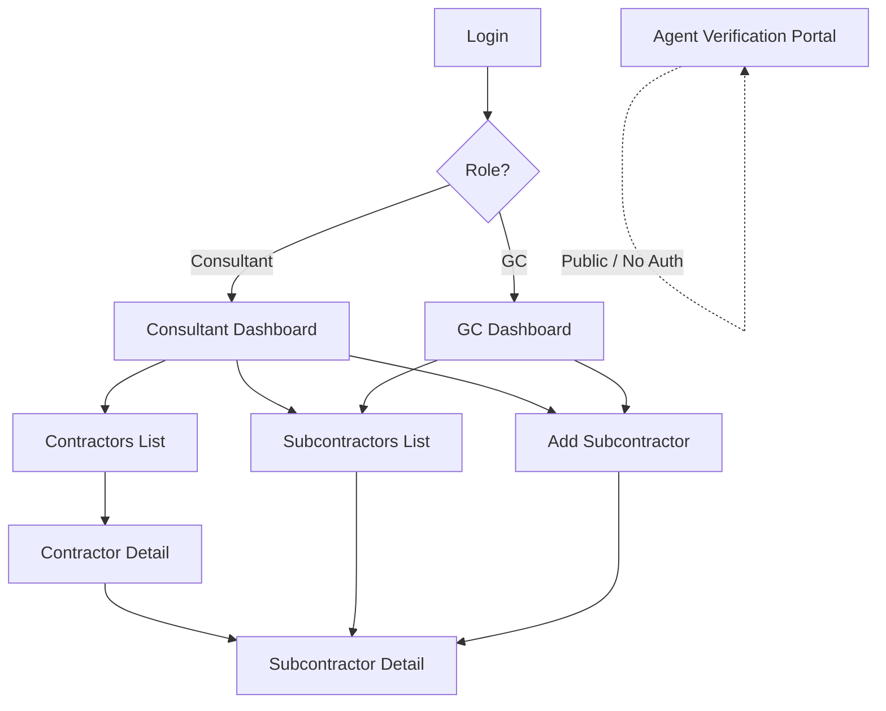

#  

**CoverVerifi** is a lightweight SaaS platform that automates subcontractor insurance compliance tracking for general contractors and their consultants. It replaces manual phone calls, spreadsheets, and expensive enterprise platforms with automated verification workflows, certificate storage, expiration alerts, and role-based dashboards. Designed for small-to-mid-size GCs managing 10-50 subcontractors per project in Idaho.

## App Structure



## Getting Started

### Prerequisites

- Node.js 18+
- npm 9+

### Install & Run

```bash
npm install
npm run dev
```

Open [http://localhost:5173](http://localhost:5173) in your browser.

### Demo Credentials

| Role | Email | Password |
|------|-------|----------|
| Consultant | dawn@boisecompliance.com | demo123 |
| GC | mike@tvbuilders.com | demo123 |
| GC | sarah@eaglerockconst.com | demo123 |

## Tech Stack

| Library | Version | Purpose |
|---------|---------|---------|
| React | 18+ | UI framework |
| Vite | 6+ | Build tool and dev server |
| TailwindCSS | 4+ | Utility-first CSS |
| React Router | 6 | Client-side routing |
| Lucide React | latest | Icon library |
| date-fns | latest | Date formatting and calculations |
| Recharts | latest | Chart components |

## Project Structure

```
├── index.html                  # Entry HTML
├── vite.config.js              # Vite + Tailwind config
├── vercel.json                 # SPA rewrites for Vercel
├── src/
│   ├── main.jsx                # React entry point
│   ├── App.jsx                 # Router and provider setup
│   ├── index.css               # Tailwind import + animations
│   ├── contexts/
│   │   ├── AuthContext.jsx     # Auth state and login/logout
│   │   └── DataContext.jsx     # App data and CRUD operations
│   ├── components/
│   │   ├── layout/
│   │   │   └── MainLayout.jsx  # Sidebar, header, footer
│   │   └── shared/
│   │       ├── Toast.jsx       # Toast notification system
│   │       ├── StatusBadge.jsx # Green/yellow/red badge
│   │       ├── Modal.jsx       # Reusable modal dialog
│   │       ├── EmptyState.jsx  # Empty state placeholder
│   │       └── LoadingSpinner.jsx
│   ├── pages/
│   │   ├── Login.jsx           # Auth page with demo accounts
│   │   ├── ConsultantDashboard.jsx  # Multi-GC overview
│   │   ├── GCDashboard.jsx     # Single-GC sub table
│   │   ├── ContractorsList.jsx # All GC clients
│   │   ├── ContractorDetail.jsx # GC detail with sub table
│   │   ├── SubcontractorsList.jsx   # All subs with filters
│   │   ├── SubcontractorDetail.jsx  # Full sub profile
│   │   ├── AddSubcontractor.jsx     # 4-step wizard
│   │   └── AgentVerification.jsx    # Public token portal
│   ├── data/
│   │   └── mockData.js         # Realistic mock data (13 tables)
│   └── utils/
│       ├── compliance.js       # Compliance engine and formatters
│       └── validators.js       # Form validation
├── supabase/
│   └── schema-stub.sql         # 13-table Postgres schema + RLS
└── docs/
    ├── technical.md            # Architecture documentation
    └── user-guide.md           # Non-technical user guide
```

## Environment Variables

For production with Supabase backend:

```env
VITE_SUPABASE_URL=https://your-project.supabase.co
VITE_SUPABASE_ANON_KEY=your-anon-key
VITE_RESEND_API_KEY=your-resend-key
```

## Deployment

### Vercel

```bash
npm run build
```

- **Build Command:** `npm run build`
- **Output Directory:** `dist`
- **Framework Preset:** Vite

The `vercel.json` file handles SPA routing rewrites.

## Available Scripts

| Script | Command | Description |
|--------|---------|-------------|
| `dev` | `npm run dev` | Start dev server with HMR |
| `build` | `npm run build` | Production build to `dist/` |
| `preview` | `npm run preview` | Preview production build locally |

## Contributing

1. Create a feature branch from `main`
2. Follow existing code patterns and naming conventions
3. Ensure `npm run build` succeeds with zero errors
4. Submit a PR with description of changes

## License

See [LICENSE](./LICENSE) for details.

---

**Built by [Acentra Labs](https://acentralabs.com)**
