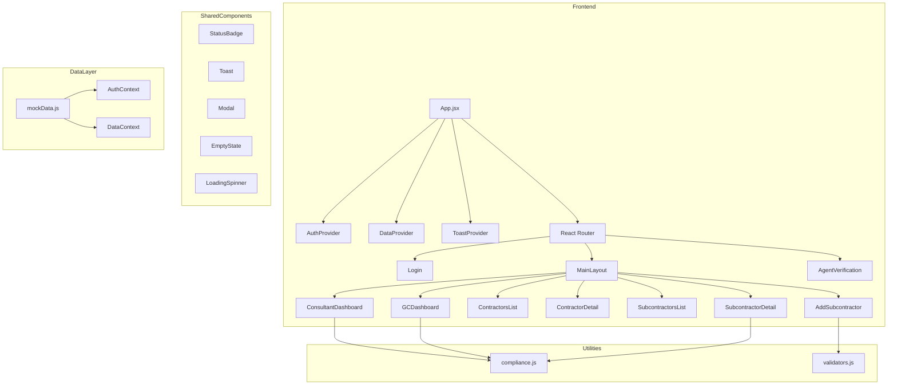
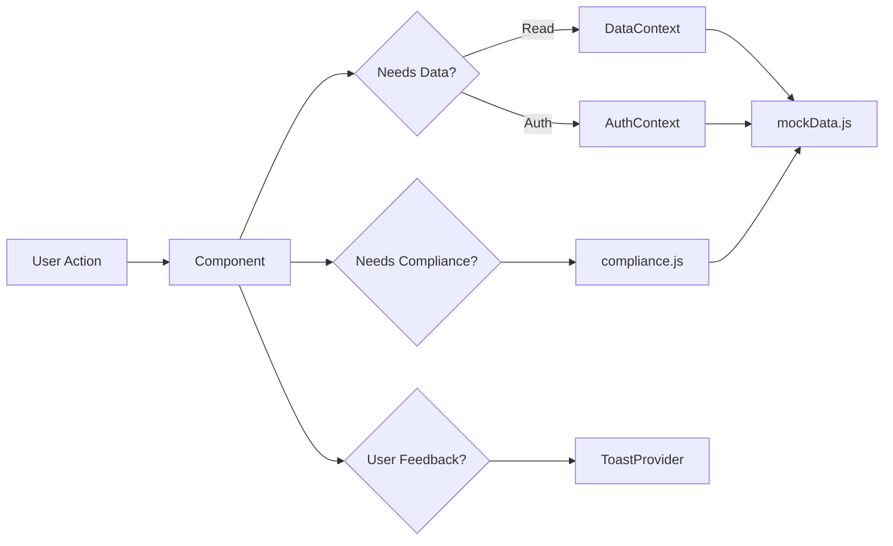
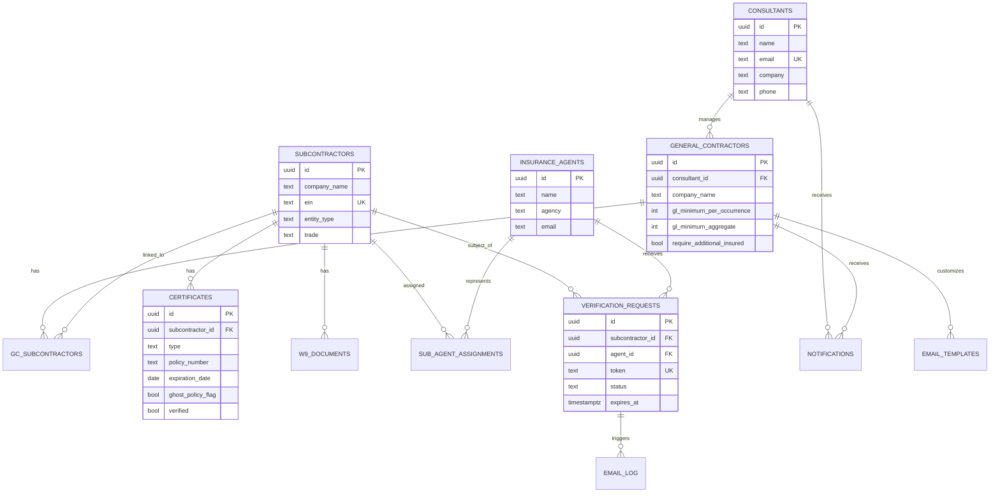

# CoverVerifi Technical Documentation

## Architecture Overview

## Data Flow

## Frontend Architecture

### Routing Structure

| Route | Component | Auth | Role |
|-------|-----------|------|------|
| `/login` | Login | Public | -- |
| `/verify/:token` | AgentVerification | Public | -- |
| `/dashboard` | ConsultantDashboard | Protected | consultant |
| `/gc-dashboard` | GCDashboard | Protected | gc |
| `/contractors` | ContractorsList | Protected | consultant |
| `/contractors/:id` | ContractorDetail | Protected | consultant |
| `/subcontractors` | SubcontractorsList | Protected | any |
| `/subcontractors/:id` | SubcontractorDetail | Protected | any |
| `/add-subcontractor` | AddSubcontractor | Protected | any |

### State Management

- **AuthContext**: User session (login/logout), role-based routing
- **DataContext**: All domain data (subs, GCs, certs, notifications), CRUD operations
- **ToastContext**: Notification toast queue with auto-dismiss

### Component Patterns

- Functional components with hooks only
- `useMemo` for derived/filtered data
- `useCallback` for stable function references in contexts
- Props for component configuration, context for shared state
- Co-located helper components (e.g., `CertCard` inside `SubcontractorDetail`)

## Data Model

### Entity Relationship Diagram

### Entity Details

| Entity | Fields | Description |
|--------|--------|-------------|
| consultants | id, name, email, company, phone, role | System administrators managing GC clients |
| general_contractors | id, consultant_id, company_name, contact_name, gl/wc requirements | GC clients with configurable compliance thresholds |
| subcontractors | id, company_name, contact_name, ein, entity_type, trade | Shared across GCs via junction table |
| gc_subcontractors | gc_id, subcontractor_id | Many-to-many junction table |
| insurance_agents | id, name, agency, email, phone | Agents linked to subcontractors |
| sub_agent_assignments | subcontractor_id, agent_id | Links subs to their agents |
| certificates | id, sub_id, type (gl/wc), policy details, limits, flags | Insurance certificates with compliance metadata |
| w9_documents | id, sub_id, file_name, tax_year, status | W-9 tax forms with annual renewal tracking |
| verification_requests | id, sub_id, agent_id, token, status, expires_at | Tokenized email verification workflows |
| email_log | id, verification_id, to_email, subject, status | Outbound email tracking |
| notifications | id, user_id, type, title, message, read | In-app notification system |
| audit_log | id, user_id, action, entity_type, details | Immutable compliance audit trail |
| email_templates | id, gc_id, template_type, subject/body templates | Per-GC customizable email templates |

## Supabase Migration Plan

### Tables

All 13 tables in `supabase/schema-stub.sql` map directly to the mock data exports in `mockData.js`. The schema uses UUIDs (production) while mock data uses integers (readability).

### Row Level Security

- **consultants**: Self-access only
- **general_contractors**: Consultant sees their GCs; GC sees own record
- **subcontractors**: Visible through `gc_subcontractors` junction filtered by consultant/GC
- **certificates, w9_documents**: Inherit access through subcontractor visibility
- **notifications**: User sees only their own
- **audit_log**: Consultant sees logs for their GCs

### Auth Strategy

- Supabase Auth with email/password
- Custom claims for role (`consultant` | `gc`) and `consultant_id` / `gc_id`
- RLS policies reference `auth.uid()` and custom claims

## API Integration Points

These locations in the frontend currently use mock data and will call Supabase when the backend is integrated:

| File | Function | Backend Call |
|------|----------|-------------|
| AuthContext.jsx | `login()` | `supabase.auth.signInWithPassword()` |
| DataContext.jsx | `addSubcontractor()` | `supabase.from('subcontractors').insert()` |
| DataContext.jsx | `getSubsForGC()` | `supabase.from('gc_subcontractors').select('*, subcontractors(*)')` |
| DataContext.jsx | `addVerification()` | `supabase.from('verification_requests').insert()` + Edge Function for email |
| DataContext.jsx | `logEmail()` | `supabase.from('email_log').insert()` |
| compliance.js | `getComplianceStatus()` | Query `certificates` table with RLS |

## Third-Party Dependencies

| Package | Purpose |
|---------|---------|
| react | UI component framework |
| react-dom | React DOM renderer |
| react-router-dom | Client-side SPA routing |
| lucide-react | SVG icon components |
| date-fns | Date parsing, formatting, difference calculations |
| recharts | Chart library (available for dashboard visualizations) |
| tailwindcss | Utility-first CSS framework |
| @tailwindcss/vite | Vite plugin for Tailwind v4 |
| vite | Build tool and dev server |
| @vitejs/plugin-react | React JSX/HMR support for Vite |

## Performance Considerations

- `useMemo` prevents recalculation of compliance status on every render
- Mock data is imported statically (tree-shakeable in production)
- Tailwind CSS purges unused styles in production builds
- No runtime CSS-in-JS overhead
- Route-level code splitting possible with `React.lazy()` when needed

## Security Considerations

- No sensitive data stored client-side beyond session token
- Tokenized agent links are time-limited (7 days) and single-use
- EIN data should be encrypted at rest in Supabase (use `pgcrypto`)
- Certificate PDFs stored in Supabase Storage with private bucket policies
- CORS configured to allow only the frontend domain
- CSP headers recommended for production deployment

## Future Architecture

When the Supabase backend is added:

1. Replace `mockData.js` imports with Supabase queries via `@supabase/supabase-js`
2. Add `@supabase/ssr` for server-side auth token handling
3. Replace DataContext CRUD with `@tanstack/react-query` + Supabase
4. Add Supabase Edge Functions for email sending (Resend/SendGrid)
5. Add Supabase Storage for certificate/W9 PDF uploads
6. Enable real-time subscriptions for notification updates
7. Add `react-hook-form` + `zod` for production form handling
